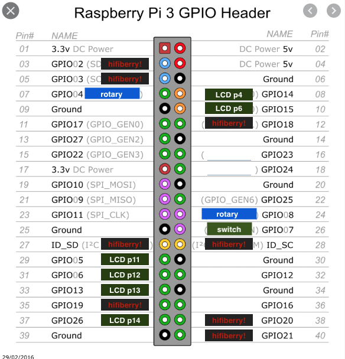

1. sudo balena scan
2. start docker
3. sudo balena push 192.168.0.130 -s .
4. sudo balena logs 192.168.8.122 --tail

### Usefull links

https://github.com/fivdi/lcd

## Pin layout

Læs mere om default pull up resistors her:

http://www.farnell.com/datasheets/1521578.pdf

## PINS

LCD:
 - GPIO 05, 06, 13, 26 = Pin 11, 12, 13, 14 = brune
 - Pin 15 = hvid
 - GPIO 15 = Pin 6 = sort
 - GPIO 14 = Pin 4 = orange
 - Pin 3 = lilla

On/Off:
 - GPIO 07 = grøn

Rotary:
 - GPIO 04 = gul
 - GPIO 08 = grå
